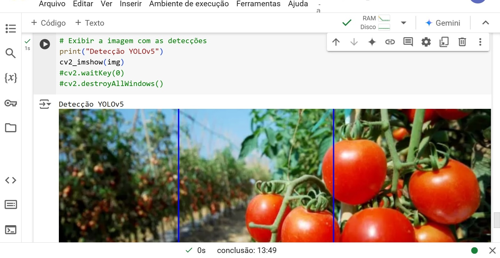

# Criação de Uma Base de Dados e Treinamento da Rede YOLO

No desafio do quinto módulo do Bootcamp BairesDev - Machine Learning Practitioner promovido pela DIO chamado "Criação de Uma Base de Dados e Treinamento da Rede YOLO" foi feito o treinamento de uma rede Yolo para identificar imagens a partir de um dataset. O código foi feito em Python no ambiente COLAB.

Bibliotecas utilizadas:

- Torch
- Torchvision
- Matplotlib
- PIL
- Yolo
- OpenCV

## YOLO

**YOLO (You Only Look Once)** é uma técnica de visão computacional projetada para tarefas de detecção de objetos em tempo real. Ela identifica e localiza múltiplos objetos em uma imagem ou vídeo com alta velocidade e precisão, tornando-a uma das arquiteturas mais populares em aplicações como vigilância, veículos autônomos e sistemas de monitoramento. A detecção é realizada em uma única etapa (daí o nome "You Only Look Once").Diferente de métodos tradicionais (como R-CNN), o YOLO não divide a imagem em regiões de interesse, analisando-a como um todo.

## Dataset

O Dataset utilizado foi obtido deste site

https://figshare.com/articles/dataset/Tomato_Dataset_YOLOV5/25249051

https://roboflow.com/model/yolov5-obb

Os labels deste dataset foram feitos para trabalhar com a rede Yolov5  Oriented Object Detection 

O código teve que ser convertido para o formato do Yolov5. O código usado para a conversão está no arquivo converter.txt

O dataset gravado na pasta Dataset_Tomate está pronto para uso, já que as pastas usadas no treinamento, chamadas "train" e "valid" foram convertidas. Apenas a pasta "val" que não foi utilizada, mantém os labels em seu formato original.

Este dataset possui mais de 300 imagens de tomates com dimensoes de 640 x 640 pixels,divididas em duas classes, tomates vermelhos e tomates verdes.

## Resultados

O treinamento feito no Colab usando as configurações padrões (sem GPU) levou 1 hora e meia para treinar o dataset com 10 épocas.

Os testes feitos posteriormente ao treinamento mostraram que o modelo pode reconhecer tomates vermelhos. Não houve sucesso ao tentar identificar tomates verde. O resultado do teste foi gravado na pasta "resultados"
